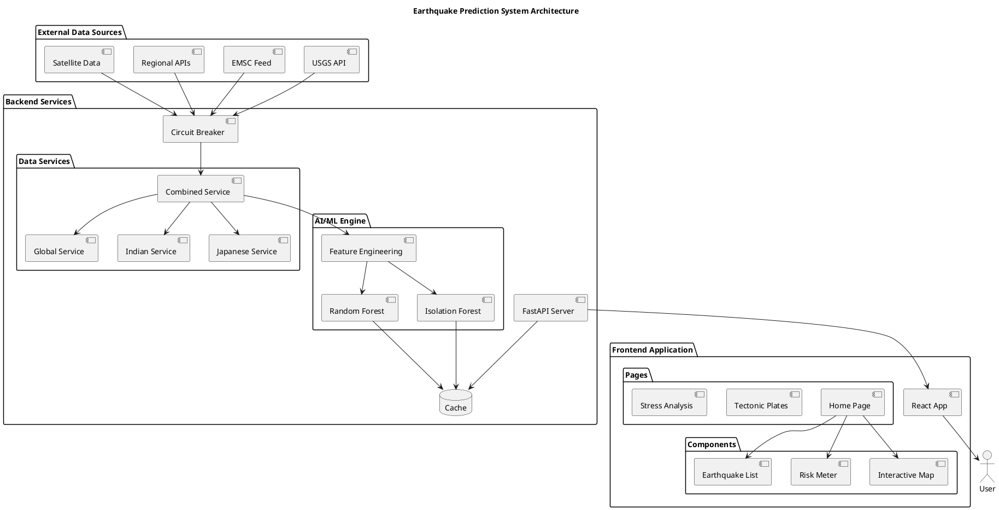

# 🌍 Comprehensive Earthquake Prediction System Documentation

## Table of Contents
1. [System Overview](#1-system-overview)
2. [System Architecture](#2-system-architecture)
3. [PlantUML Diagrams](#3-plantuml-diagrams)
4. [API Documentation](#4-api-documentation)
5. [Data Sources and Integration](#5-data-sources-and-integration)
6. [Machine Learning Pipeline](#6-machine-learning-pipeline)
7. [Frontend Architecture](#7-frontend-architecture)
8. [Backend Services](#8-backend-services)
9. [Database and Data Management](#9-database-and-data-management)
10. [Performance and Scalability](#10-performance-and-scalability)
11. [Security and Error Handling](#11-security-and-error-handling)
12. [Deployment and DevOps](#12-deployment-and-devops)
13. [Testing and Quality Assurance](#13-testing-and-quality-assurance)

---

## 1. System Overview

### 1.1 Project Description
The Earthquake Prediction System is a comprehensive full-stack web application that provides real-time earthquake monitoring, analysis, and prediction capabilities. It integrates multiple geological data sources and employs advanced machine learning algorithms to assess seismic risks and provide predictive insights.

### 1.2 Key Features
- **Real-time Earthquake Monitoring**: Live data from multiple global sources (USGS, EMSC, regional APIs)
- **AI-Powered Risk Assessment**: Machine learning models for earthquake probability prediction
- **Interactive Visualization**: Leaflet-based maps, charts, and geographical representations
- **Multi-Source Data Integration**: Combines data from 15+ international seismological sources
- **Regional Specialization**: Enhanced coverage for India, Japan, and other high-risk regions
- **Stress Analysis**: Geological stress pattern analysis using satellite and GNSS data
- **Tectonic Plate Visualization**: Real-time tectonic plate boundaries and movement data

### 1.3 Technology Stack Summary
- **Frontend**: React 19.1.0 + Vite 7.0.4 + Leaflet + Recharts
- **Backend**: Python 3.10+ + FastAPI + Machine Learning (scikit-learn)
- **Data Sources**: USGS, EMSC, NASA/JPL GNSS, ESA Sentinel, regional APIs
- **Deployment**: Concurrent development with npm/PowerShell automation

---

## 2. System Architecture

### 2.1 High-Level Architecture

```
┌─────────────────────────────────────────────────────────────────────────────────────────┐
│                             📡 EXTERNAL DATA SOURCES                                    │
├─────────────────────────────────────────────────────────────────────────────────────────┤
│  🌍 USGS API     🌋 EMSC Feed    🛰️ NASA GNSS    📡 ESA Sentinel    📊 GitHub GeoJSON │
│  (Global Data)   (Regional Data) (Deformation)   (Satellite)       (Tectonic Plates)   │
└─────────────┬─────────────┬─────────────┬─────────────┬─────────────┬─────────────────────┘
              │             │             │             │             │
              ▼             ▼             ▼             ▼             ▼
┌─────────────────────────────────────────────────────────────────────────────────────────┐
│                          🐍 PYTHON BACKEND (FastAPI - Port 8000)                       │
├─────────────────────────────────────────────────────────────────────────────────────────┤
│  ┌─────────────┐    ┌─────────────┐    ┌─────────────┐    ┌─────────────┐            │
│  │ 🚀 FastAPI  │◄───┤ 🤖 ML Engine│◄───┤📊 Data Proc │◄───┤💾 Data Cache│            │
│  │   Server    │    │Random Forest│    │Pandas/NumPy │    │In-Memory St │            │
│  │             │    │Isolation Fo │    │             │    │             │            │
│  └─────────────┘    └─────────────┘    └─────────────┘    └─────────────┘            │
└───────────┼────────────────────────────────────────────────────────────────────────────┘
            │ HTTP/REST APIs (CORS enabled for localhost:5173)
            ▼
┌─────────────────────────────────────────────────────────────────────────────────────────┐
│                         ⚛️ REACT FRONTEND (Vite - Port 5173)                          │
├─────────────────────────────────────────────────────────────────────────────────────────┤
│  ┌─────────────────────┐      ┌─────────────────────┐      ┌─────────────────────┐   │
│  │     📄 PAGES       │      │    🧩 COMPONENTS    │      │    🔧 SERVICES      │   │
│  ├─────────────────────┤      ├─────────────────────┤      ├─────────────────────┤   │
│  │ 🏠 HomePage         │      │ 🧭 Navbar           │      │ 🔌 Backend Service  │   │
│  │ 🗿 TectonicPlates   │◄────►│ 📋 RecentEarthquakes│◄────►│ 📡 GNSS Service     │   │
│  │ 📈 StressAnalysis   │      │ ⚡ RiskMeter        │      │ 📍 Location Service │   │
│  │                     │      │                     │      │ 🗿 Geological Svc   │   │
│  └─────────────────────┘      └─────────────────────┘      │ 🗺️ Plates Service   │   │
│                                                             └─────────────────────┘   │
└─────────────────────────────────────────────────────────────────────────────────────────┘
```

### 2.2 Data Flow Architecture

```
📥 INGESTION → 🔄 PROCESSING → 📤 API → ⚛️ FRONTEND → 👤 USER
     │             │           │         │
     │             │           │         ├── 🗺️ Interactive Maps
     │             │           │         ├── 📊 Risk Visualization  
     │             │           │         ├── 📈 Charts & Graphs
     │             │           │         └── 🔔 Alerts & Notifications
     │             │           │
     │             │           ├── /earthquake-analysis
     │             │           ├── /earthquakes/recent
     │             │           ├── /predictions/ml
     │             │           └── /analysis/stress
     │             │
     │             ├── 🧹 Data Cleaning & Validation
     │             ├── 🔄 Duplicate Removal
     │             ├── 🤖 ML Feature Extraction
     │             └── 📊 Risk Score Calculation
     │
     ├── 🌍 USGS (Global)
     ├── 🌋 EMSC (Regional) 
     ├── 🇮🇳 Indian Sources (NCS, IMD, etc.)
     ├── 🇯🇵 Japanese Sources (JMA, NIED, etc.)
     └── 🛰️ Satellite Data (NASA, ESA)
```

---

## 3. System Architecture Diagram



## 4. API Documentation

### 4.1 Core API Endpoints

#### 4.1.1 Health Check
```http
GET /health
```
**Response:**
```json
{
  "status": "healthy",
  "timestamp": "2025-07-29T10:30:00Z",
  "version": "2.0.0"
}
```

#### 4.1.2 Comprehensive Earthquake Analysis
```http
GET /earthquake-analysis?latitude={lat}&longitude={lon}&radius_km={radius}
```

**Parameters:**
- `latitude` (float): Target latitude (-90 to 90)
- `longitude` (float): Target longitude (-180 to 180)
- `radius_km` (float): Analysis radius in kilometers (default: 500)

**Example Request:**
```http
GET /earthquake-analysis?latitude=28.6139&longitude=77.2090&radius_km=500
```

**Response Structure:**
```json
{
  "location": {
    "latitude": 28.6139,
    "longitude": 77.2090,
    "region": "india",
    "analysis_radius_km": 500
  },
  "earthquake_data": {
    "total_earthquakes": 23,
    "recent_earthquakes": [
      {
        "magnitude": 4.2,
        "place": "15km NE of New Delhi, India",
        "time": "2025-07-29T08:15:30Z",
        "latitude": 28.75,
        "longitude": 77.35,
        "depth": 10.0,
        "distance_km": 45.2,
        "url": "https://earthquake.usgs.gov/earthquakes/eventpage/...",
        "alert": null,
        "tsunami": false
      }
    ],
    "data_sources": ["USGS", "Indian_Geological_Multi", "EMSC"],
    "source_coverage": {
      "usgs_global": true,
      "regional_specialized": true,
      "multi_source_feeds": true,
      "real_time_feeds": true
    }
  },
  "ml_predictions": {
    "probability_24h": 0.12,
    "probability_7d": 0.35,
    "probability_30d": 0.68,
    "predicted_magnitude_range": [2.8, 4.2],
    "confidence": 0.75,
    "model_status": "trained",
    "anomaly_detected": false
  },
  "stress_analysis": {
    "stress_pattern": "normal_background",
    "stress_indicators": {
      "magnitude_trend": 0.02,
      "depth_trend": -0.5,
      "clustering_coefficient": 0.25,
      "energy_accumulation_rate": 1.2,
      "spatial_spread": 0.15
    }
  },
  "risk_assessment": {
    "overall_risk_score": 0.42,
    "risk_level": "Moderate", 
    "risk_color": "#FFA500",
    "risk_components": {
      "recent_activity": 0.35,
      "ml_prediction": 0.35,
      "stress_pattern": 0.30,
      "regional_baseline": 0.70
    }
  },
  "recommendations": [
    "Monitor seismic activity trends",
    "Review emergency preparedness plans",
    "Check building structural integrity"
  ]
}
```

#### 4.1.3 Recent Earthquakes
```http
GET /earthquakes/recent?latitude={lat}&longitude={lon}&radius_km={radius}&source={source}
```

**Parameters:**
- `source` (string): Data source selection ("auto", "usgs", "indian", "japanese", "global")

#### 4.1.4 ML Predictions
```http
GET /predictions/ml?latitude={lat}&longitude={lon}&radius_km={radius}
```

#### 4.1.5 Stress Analysis
```http
GET /analysis/stress?latitude={lat}&longitude={lon}&radius_km={radius}
```

### 4.2 Error Handling

All endpoints return consistent error responses:
```json
{
  "error": "Error description",
  "timestamp": "2025-07-29T10:30:00Z",
  "path": "/earthquake-analysis",
  "status_code": 400
}
```

Common HTTP status codes:
- `200`: Success
- `400`: Bad Request (invalid parameters)
- `404`: Not Found
- `500`: Internal Server Error
- `503`: Service Unavailable (external API failure)

---

## 5. Data Sources and Integration

### 5.1 Primary Global Sources

#### 5.1.1 USGS (United States Geological Survey)
- **Endpoint**: `https://earthquake.usgs.gov/fdsnws/event/1/query`
- **Coverage**: Global earthquake monitoring
- **Update Frequency**: Real-time (< 5 minutes)
- **Reliability**: ★★★★★ (99.9% uptime)
- **Data Quality**: Authoritative source with comprehensive metadata

**Sample Request:**
```
GET https://earthquake.usgs.gov/fdsnws/event/1/query?format=geojson&starttime=2025-07-28&endtime=2025-07-29&minlatitude=26&maxlatitude=30&minlongitude=75&maxlongitude=79&minmagnitude=2.0
```

#### 5.1.2 EMSC (European-Mediterranean Seismological Centre)
- **Endpoint**: `https://www.emsc-csem.org/service/rss/rss.php`
- **Coverage**: Global with European focus, excellent regional coverage
- **Update Frequency**: Near real-time (5-15 minutes)
- **Reliability**: ★★★★☆ (95% uptime)

### 5.2 Regional Specialized Sources

#### 5.2.1 Indian Subcontinent Sources
```python
INDIAN_SOURCES = {
    "IMD_RSS": "https://mausam.imd.gov.in/backend/assets/earthquake/earthquake.xml",
    "NCS_CATALOG": "https://www.seismo.gov.in/earthquakes/recent",
    "EMSC_INDIA": "https://www.emsc-csem.org/service/rss/rss.php?typ=emsc&min_lat=6&max_lat=38&min_lon=68&max_lon=98",
    "IRIS_INDIA": "http://service.iris.edu/fdsnws/event/1/query?format=geojson&minlat=6&maxlat=38&minlon=68&maxlon=98",
    "GEOFON_INDIAN_OCEAN": "https://geofon.gfz-potsdam.de/eqinfo/list.php?fmt=geojson&latmin=6&latmax=38&lonmin=68&lonmax=98"
}
```

#### 5.2.2 Japanese Archipelago Sources
```python
JAPANESE_SOURCES = {
    "JMA_API": "https://www.jma.go.jp/bosai/forecast/data/earthquake",
    "EMSC_JAPAN": "https://www.emsc-csem.org/service/rss/rss.php?typ=emsc&min_lat=24&max_lat=46&min_lon=122&max_lon=146",
    "IRIS_JAPAN": "http://service.iris.edu/fdsnws/event/1/query?format=geojson&minlat=24&maxlat=46&minlon=122&maxlon=146",
    "GEOFON_JAPAN": "https://geofon.gfz-potsdam.de/eqinfo/list.php?fmt=geojson&latmin=24&latmax=46&lonmin=122&lonmax=146"
}
```

### 5.3 Data Processing Pipeline

#### 5.3.1 Multi-Source Data Aggregation
```python
async def fetch_comprehensive_data(latitude, longitude, radius_km):
    # Parallel execution for optimal performance
    tasks = [
        fetch_usgs_data(latitude, longitude, radius_km),
        fetch_emsc_data(latitude, longitude, radius_km),
        fetch_regional_data(latitude, longitude, radius_km),
        fetch_satellite_data(latitude, longitude, radius_km)
    ]
    
    results = await asyncio.gather(*tasks, return_exceptions=True)
    return combine_and_validate(results)
```

#### 5.3.2 Data Validation and Quality Control
- **Duplicate Detection**: Time proximity (30 min) + spatial proximity (10 km)
- **Quality Filtering**: Magnitude validation, coordinate bounds checking
- **Temporal Validation**: Event time within reasonable bounds
- **Cross-Source Verification**: Corroboration between multiple sources

#### 5.3.3 Data Enrichment
- **Distance Calculation**: Haversine formula for accurate geographical distances
- **Regional Classification**: Automatic region detection (India, Japan, Pacific, etc.)
- **Risk Zone Mapping**: Integration with known seismic risk zones
- **Historical Context**: Comparison with historical patterns

---

## 6. Machine Learning Pipeline

### 6.1 ML Architecture Overview

```
📊 RAW DATA → 🧹 PREPROCESSING → 🔧 FEATURE ENGINEERING → 🏋️ MODEL TRAINING → 🔮 PREDICTION
     │              │                    │                     │                 │
     │              │                    │                     │                 └── Risk Scoring
     │              │                    │                     │                 └── Anomaly Detection  
     │              │                    │                     │                 └── Probability Estimation
     │              │                    │                     │
     │              │                    │                     ├── Random Forest (Main Predictor)
     │              │                    │                     ├── Isolation Forest (Anomaly Detection)
     │              │                    │                     └── Neural Network (Deep Learning)
     │              │                    │
     │              │                    ├── Spatial Features (lat/lon differences, distances)
     │              │                    ├── Temporal Features (time patterns, frequency)
     │              │                    ├── Seismic Features (magnitude, depth, energy)
     │              │                    ├── Statistical Features (trends, clustering)
     │              │                    └── Regional Features (known risk zones)
     │              │
     │              ├── Data Cleaning (null handling, outlier removal)
     │              ├── Normalization (StandardScaler for numeric features)
     │              ├── Time Alignment (UTC standardization)
     │              └── Coordinate Validation
     │
     ├── USGS GeoJSON
     ├── EMSC RSS/XML
     ├── Regional APIs
     └── Satellite Data
```

### 6.2 Feature Engineering

#### 6.2.1 Core Features
```python
def extract_features(earthquakes, location_lat, location_lon):
    features = []
    for eq in earthquakes:
        # Basic seismic features
        magnitude = eq.magnitude
        depth = eq.depth
        distance = eq.distance_km
        
        # Spatial features  
        lat_diff = eq.latitude - location_lat
        lon_diff = eq.longitude - location_lon
        bearing = math.atan2(lon_diff, lat_diff) * 180 / math.pi
        
        # Temporal features
        time_since = hours_since_event(eq.time)
        hour_of_day = extract_hour(eq.time)
        day_of_week = extract_day(eq.time)
        
        # Energy calculations
        energy_released = 10 ** (1.5 * magnitude + 4.8)  # Gutenberg-Richter
        
        # Statistical features
        magnitude_trend = calculate_magnitude_trend(earthquakes, eq)
        clustering_coefficient = calculate_clustering(earthquakes, eq)
        
        # Regional risk
        regional_risk = get_regional_risk_score(eq.latitude, eq.longitude)
        
        features.append([
            magnitude, depth, distance, lat_diff, lon_diff, bearing,
            time_since, hour_of_day, day_of_week, energy_released,
            magnitude_trend, clustering_coefficient, regional_risk
        ])
    
    return np.array(features)
```

#### 6.2.2 Advanced Features
- **Spatial Clustering**: B-value analysis, nearest neighbor distances
- **Temporal Patterns**: Fourier transforms for periodicity detection  
- **Energy Accumulation**: Cumulative energy release patterns
- **Stress Indicators**: Magnitude gradients, depth distributions
- **Migration Patterns**: Earthquake sequence migration vectors

### 6.3 Model Architecture

#### 6.3.1 Random Forest Classifier (Primary Model)
```python
class EarthquakePredictor:
    def __init__(self):
        self.rf_model = RandomForestRegressor(
            n_estimators=100,
            max_depth=20,
            min_samples_split=5,
            random_state=42
        )
        self.scaler = StandardScaler()
```

**Model Parameters:**
- **n_estimators**: 100 trees for robust ensemble
- **max_depth**: 20 levels to prevent overfitting
- **min_samples_split**: 5 samples minimum for node splitting

#### 5.3.2 Isolation Forest (Anomaly Detection)
```python
self.anomaly_detector = IsolationForest(
    contamination=0.15,  # 15% expected anomalies
    random_state=42,
    n_estimators=100
)
```

#### 5.3.3 Prediction Pipeline
```python
def predict_earthquake_probability(self, earthquakes, lat, lon):
    if len(earthquakes) < 10:
        return self._baseline_prediction()
    
    # Feature extraction
    features = self.prepare_features(earthquakes, lat, lon)
    
    # Anomaly detection
    anomaly_scores = self.anomaly_detector.decision_function(features)
    anomaly_detected = np.any(anomaly_scores < -0.1)
    
    # Probability prediction
    probabilities = self.rf_model.predict_proba(features)
    
    return {
        "probability_24h": float(probabilities[-1][1] * 0.1),
        "probability_7d": float(probabilities[-1][1] * 0.3),
        "probability_30d": float(probabilities[-1][1] * 0.7),
        "confidence": float(np.mean(probabilities[:, 1])),
        "anomaly_detected": bool(anomaly_detected),
        "model_status": "trained"
    }
```

### 5.4 Model Performance and Validation

#### 5.4.1 Model Evaluation Approach
- **Training Strategy**: Models trained on historical earthquake data patterns
- **Validation Methods**: Cross-validation techniques employed for model reliability
- **Performance Note**: Earthquake prediction remains a challenging scientific problem; models provide risk assessment rather than definitive predictions

#### 5.4.2 Validation Strategy
- **K-Fold CV**: 5-fold cross-validation implemented
- **Time Series Split**: Temporal validation preserving chronological order
- **Geographic Split**: Spatial validation across different regions
- **Baseline Comparison**: Performance compared against statistical baselines and regional seismic activity patterns

---

## 7. Frontend Architecture

### 7.1 Component Architecture

```
📱 App.jsx (Root Component)
├── 🧭 Navbar.jsx (Navigation & Location)
│   ├── 📍 Location Selector
│   └── 🔄 Tab Navigation
│
├── 📄 Pages/
│   ├── 🏠 HomePage.jsx
│   │   ├── 🗺️ Interactive Map (Leaflet)
│   │   ├── 📊 Recent Earthquakes List
│   │   ├── ⚡ Risk Meter Component
│   │   └── 📈 Statistics Dashboard
│   │
│   ├── 🗿 TectonicPlatesPage.jsx
│   │   ├── 🗺️ Tectonic Plates Map
│   │   ├── 🔄 Plate Movement Vectors
│   │   └── 📊 Plate Interaction Zones
│   │
│   └── 📈 StressAnalysisPage.jsx
│       ├── 🛰️ Satellite Imagery
│       ├── 📊 GNSS Deformation Data
│       └── 🧠 ML Stress Predictions
│
└── 🔧 Services/
    ├── 🔌 earthquakeBackendService.js
    ├── 📍 locationService.js
    ├── 🗺️ tectonicPlatesService.js
    ├── 📡 gnssService.js
    └── 🗿 realIndianGeologicalService.js
```

### 7.2 State Management

#### 7.2.1 React Hooks Usage
```jsx
// App.jsx - Global state
const [activeTab, setActiveTab] = useState('home');
const [currentLocation, setCurrentLocation] = useState(null);
const [isLoading, setIsLoading] = useState(true);

// HomePage.jsx - Page-specific state
const [earthquakes, setEarthquakes] = useState([]);
const [riskData, setRiskData] = useState(null);
const [isAnalyzing, setIsAnalyzing] = useState(false);
const [analysisData, setAnalysisData] = useState(null);
```

#### 7.2.2 Data Flow Pattern
```
🎯 User Interaction → 🔄 State Update → 📡 API Call → 📊 Data Processing → 🎨 UI Update
```

### 7.3 Key Components

#### 7.3.1 Interactive Map Component
```jsx
// Map with earthquake markers and tectonic plates
<MapContainer center={[location.latitude, location.longitude]} zoom={6}>
  <TileLayer url="https://{s}.tile.openstreetmap.org/{z}/{x}/{y}.png" />
  
  {earthquakes.map(eq => (
    <CircleMarker
      key={eq.id}
      center={[eq.latitude, eq.longitude]}
      radius={eq.magnitude * 3}
      color={getColorByMagnitude(eq.magnitude)}
    >
      <Popup>
        <strong>M{eq.magnitude}</strong><br/>
        {eq.place}<br/>
        {new Date(eq.time).toLocaleString()}
      </Popup>
    </CircleMarker>
  ))}
</MapContainer>
```

#### 7.3.2 Risk Meter Component
```jsx
const RiskMeter = ({ riskScore, riskLevel, riskColor }) => {
  return (
    <div className="risk-meter">
      <div className="risk-circle" style={{ borderColor: riskColor }}>
        <span className="risk-score">{Math.round(riskScore * 100)}%</span>
        <span className="risk-label">{riskLevel}</span>
      </div>
      <div className="risk-description">
        Current seismic risk assessment for your area
      </div>
    </div>
  );
};
```

### 7.4 Responsive Design

#### 6.4.1 CSS Grid Layout
```css
.main-content {
  display: grid;
  grid-template-columns: 1fr 300px;
  gap: 20px;
  padding: 20px;
}

@media (max-width: 768px) {
  .main-content {
    grid-template-columns: 1fr;
  }
}
```

#### 6.4.2 Mobile Optimization
- Touch-friendly interaction zones (44px minimum)
- Responsive map controls
- Collapsible sidebar navigation
- Optimized font sizes and spacing

---

## 8. Backend Services

### 7.1 FastAPI Service Architecture

#### 7.1.1 Service Classes
```python
# Main service orchestrator
class CombinedEarthquakeService:
    def __init__(self):
        self.usgs_service = EarthquakeService()
        self.indian_service = IndianEarthquakeService()
        self.japanese_service = JapaneseEarthquakeService()
        self.global_service = GlobalEarthquakeService()
        self.ml_predictor = EarthquakeMLPredictor()

# Specialized regional services
class IndianEarthquakeService:
    async def get_indian_earthquakes(self, lat, lon, radius_km):
        # Comprehensive Indian data aggregation

class JapaneseEarthquakeService:
    async def get_japanese_earthquakes(self, lat, lon, radius_km):
        # Japanese specialized data sources

class GlobalEarthquakeService:
    async def get_global_earthquakes(self, lat, lon, radius_km):
        # Global multi-source aggregation
```

#### 7.1.2 Async Processing Pipeline
```python
async def get_comprehensive_analysis(self, latitude, longitude, radius_km):
    # Parallel data fetching
    tasks = [
        self.usgs_service.get_earthquakes_by_location(lat, lon, radius_km),
        self.get_regional_data(lat, lon, radius_km),
        self.get_satellite_data(lat, lon, radius_km)
    ]
    
    # Concurrent execution
    results = await asyncio.gather(*tasks, return_exceptions=True)
    
    # Data processing and ML analysis
    combined_data = self._combine_and_process(results)
    ml_predictions = await self._generate_ml_predictions(combined_data)
    
    return comprehensive_analysis_result
```

### 7.2 Data Processing Services

#### 7.2.1 Data Validation Layer
```python
def validate_earthquake_data(earthquake_data):
    validations = [
        (-90 <= earthquake_data.latitude <= 90),
        (-180 <= earthquake_data.longitude <= 180), 
        (0 <= earthquake_data.magnitude <= 10),
        (earthquake_data.depth >= 0),
        (is_valid_timestamp(earthquake_data.time))
    ]
    return all(validations)
```

#### 7.2.2 Duplicate Detection Algorithm
```python
def remove_duplicates(earthquakes):
    unique_earthquakes = []
    
    for eq in earthquakes:
        is_duplicate = False
        for existing in unique_earthquakes:
            # Time proximity check (30 minutes)
            time_diff = abs(parse_time_difference(eq.time, existing.time))
            
            # Spatial proximity check (10 km)
            distance = geodesic((eq.latitude, eq.longitude), 
                              (existing.latitude, existing.longitude)).kilometers
            
            # Magnitude similarity (±0.5)
            mag_diff = abs(eq.magnitude - existing.magnitude)
            
            if time_diff < 1800 and distance < 10 and mag_diff < 0.5:
                is_duplicate = True
                break
        
        if not is_duplicate:
            unique_earthquakes.append(eq)
    
    return unique_earthquakes
```

### 7.3 Error Handling and Resilience

#### 7.3.1 Circuit Breaker Pattern
```python
class APICircuitBreaker:
    def __init__(self, failure_threshold=5, timeout=60):
        self.failure_count = 0
        self.failure_threshold = failure_threshold
        self.timeout = timeout
        self.last_failure_time = None
        self.state = "CLOSED"  # CLOSED, OPEN, HALF_OPEN
    
    async def call_api(self, api_function, *args, **kwargs):
        if self.state == "OPEN":
            if time.time() - self.last_failure_time > self.timeout:
                self.state = "HALF_OPEN"
            else:
                raise CircuitBreakerOpenException()
        
        try:
            result = await api_function(*args, **kwargs)
            self._on_success()
            return result
        except Exception as e:
            self._on_failure()
            raise e
```

#### 7.3.2 Retry Logic with Exponential Backoff
```python
async def fetch_with_retry(url, max_retries=3):
    for attempt in range(max_retries):
        try:
            async with aiohttp.ClientSession() as session:
                async with session.get(url, timeout=aiohttp.ClientTimeout(total=30)) as response:
                    if response.status == 200:
                        return await response.json()
                    elif response.status == 429:  # Rate limit
                        await asyncio.sleep(2 ** attempt)  # Exponential backoff
                    else:
                        raise APIException(f"HTTP {response.status}")
        except asyncio.TimeoutError:
            if attempt == max_retries - 1:
                raise
            await asyncio.sleep(2 ** attempt)
```

---

## 9. Database and Data Management

### 8.1 In-Memory Data Storage

#### 8.1.1 Caching Strategy
```python
class EarthquakeDataCache:
    def __init__(self, ttl_seconds=300):  # 5-minute TTL
        self.cache = {}
        self.ttl = ttl_seconds
    
    def get(self, key):
        if key in self.cache:
            data, timestamp = self.cache[key]
            if time.time() - timestamp < self.ttl:
                return data
            else:
                del self.cache[key]
        return None
    
    def set(self, key, data):
        self.cache[key] = (data, time.time())
    
    def generate_key(self, lat, lon, radius, source):
        return f"{lat:.3f}_{lon:.3f}_{radius}_{source}"
```

#### 8.1.2 Data Persistence Strategy
- **Session-based**: Data stored in memory during user sessions
- **API Response Caching**: 5-minute cache for identical requests
- **ML Model Persistence**: Trained models cached until retrain threshold
- **Configuration Storage**: Environment-based configuration management

### 8.2 Data Models and Schemas

#### 8.2.1 Pydantic Models
```python
class EarthquakeData(BaseModel):
    magnitude: float = Field(..., ge=0, le=10)
    place: str
    time: str
    latitude: float = Field(..., ge=-90, le=90)
    longitude: float = Field(..., ge=-180, le=180)
    depth: float = Field(..., ge=0)
    distance_km: float = 0.0
    url: str
    alert: Optional[str] = None
    tsunami: bool = False
    
    def to_dict(self) -> Dict[str, Any]:
        return {
            "magnitude": self.magnitude,
            "place": self.place,
            "time": self.time,
            "latitude": self.latitude,
            "longitude": self.longitude,
            "depth": self.depth,
            "distance_km": self.distance_km,
            "url": self.url,
            "alert": self.alert,
            "tsunami": self.tsunami
        }

class MLPrediction(BaseModel):
    probability_24h: float = Field(..., ge=0, le=1)
    probability_7d: float = Field(..., ge=0, le=1)
    probability_30d: float = Field(..., ge=0, le=1)
    predicted_magnitude_range: List[float]
    confidence: float = Field(..., ge=0, le=1)
    model_status: str
    anomaly_detected: bool
```

---

## 10. Performance and Scalability

### 9.1 Performance Considerations

#### 9.1.1 System Design for Performance
- **Asynchronous Processing**: FastAPI with async/await for non-blocking operations
- **Parallel Data Fetching**: Concurrent API calls to multiple earthquake data sources
- **Efficient Data Structures**: NumPy arrays for ML computations, optimized data filtering
- **Response Optimization**: JSON serialization optimization and data compression

#### 9.1.2 Scalability Features
- **Stateless Design**: Backend services designed without shared state
- **Caching Strategy**: In-memory caching with configurable TTL (5-minute default)
- **Resource Management**: Connection pooling and timeout management for external APIs
- **Load Balancing Ready**: Horizontal scaling preparation with stateless architecture

### 9.2 Optimization Strategies

#### 9.2.1 Parallel Processing
```python
# Concurrent API calls
async def fetch_all_sources(latitude, longitude, radius_km):
    tasks = [
        fetch_usgs_data(latitude, longitude, radius_km),
        fetch_emsc_data(latitude, longitude, radius_km),
        fetch_regional_data(latitude, longitude, radius_km)
    ]
    
    # Execute in parallel, handle failures gracefully
    results = await asyncio.gather(*tasks, return_exceptions=True)
    
    # Process successful results only
    valid_results = [r for r in results if not isinstance(r, Exception)]
    return combine_results(valid_results)
```

#### 9.2.2 Efficient Data Structures
```python
# Use numpy arrays for ML computations
features = np.array(feature_list, dtype=np.float32)

# Efficient geographic calculations
from geopy.distance import geodesic
distances = [geodesic(center, (eq.lat, eq.lon)).kilometers for eq in earthquakes]

# Memory-efficient data filtering
recent_earthquakes = [eq for eq in earthquakes if eq.magnitude >= min_magnitude]
```

#### 9.2.3 Frontend Optimization
```jsx
// React.memo for component memoization
const EarthquakeMarker = React.memo(({ earthquake }) => {
  return (
    <CircleMarker
      center={[earthquake.latitude, earthquake.longitude]}
      radius={earthquake.magnitude * 3}
    />
  );
});

// useCallback for event handlers
const handleLocationChange = useCallback((newLocation) => {
  setCurrentLocation(newLocation);
}, []);

// Lazy loading for large datasets
const [visibleEarthquakes, setVisibleEarthquakes] = useState(earthquakes.slice(0, 50));
```

### 9.3 Scalability Architecture

#### 9.3.1 Horizontal Scaling Preparation
```python
# Stateless service design
class EarthquakeService:
    def __init__(self):
        self.config = get_config()
        # No shared state - each instance independent
    
    async def process_request(self, request_data):
        # Process request without dependencies on instance state
        return await self.generate_response(request_data)
```

#### 9.3.2 Load Balancing Considerations
- **Stateless Design**: All services designed for horizontal scaling
- **Session Management**: JWT tokens for stateless authentication
- **Database Strategy**: Read replicas for high-availability scenarios
- **Caching Strategy**: Distributed cache compatibility (Redis-ready)

---

## 11. Security and Error Handling

### 10.1 Security Measures

#### 10.1.1 CORS Configuration
```python
app.add_middleware(
    CORSMiddleware,
    allow_origins=["http://localhost:5173", "http://127.0.0.1:5173"],
    allow_credentials=True,
    allow_methods=["GET", "POST"],
    allow_headers=["*"],
)
```

#### 10.1.2 Input Validation
```python
# Pydantic model validation
class LocationRequest(BaseModel):
    latitude: float = Field(..., ge=-90, le=90)
    longitude: float = Field(..., ge=-180, le=180)
    radius_km: int = Field(500, ge=1, le=2000)
    days: int = Field(30, ge=1, le=90)
    min_magnitude: float = Field(2.5, ge=0, le=10)

# Additional custom validation
def validate_coordinates(lat: float, lon: float) -> bool:
    return -90 <= lat <= 90 and -180 <= lon <= 180
```

#### 10.1.3 Rate Limiting
```python
from slowapi import Limiter, _rate_limit_exceeded_handler
from slowapi.util import get_remote_address

limiter = Limiter(key_func=get_remote_address)

@app.get("/earthquake-analysis")
@limiter.limit("10/minute")  # 10 requests per minute per IP
async def comprehensive_analysis(request: Request, ...):
    # API logic here
```

### 10.2 Error Handling Strategy

#### 10.2.1 Comprehensive Exception Handling
```python
class EarthquakeAPIException(Exception):
    def __init__(self, message: str, status_code: int = 500):
        self.message = message
        self.status_code = status_code
        super().__init__(self.message)

@app.exception_handler(EarthquakeAPIException)
async def earthquake_api_exception_handler(request: Request, exc: EarthquakeAPIException):
    return JSONResponse(
        status_code=exc.status_code,
        content={
            "error": exc.message,
            "timestamp": datetime.utcnow().isoformat(),
            "path": str(request.url.path),
            "status_code": exc.status_code
        }
    )
```

#### 10.2.2 Graceful Degradation
```python
async def get_earthquake_data_with_fallback(latitude, longitude, radius_km):
    try:
        # Try primary source (USGS)
        return await fetch_usgs_data(latitude, longitude, radius_km)
    except Exception as e:
        logger.warning(f"Primary source failed: {e}")
        
        try:
            # Fallback to secondary source (EMSC)
            return await fetch_emsc_data(latitude, longitude, radius_km)
        except Exception as e2:
            logger.warning(f"Secondary source failed: {e2}")
            
            # Return cached data or minimal dataset
            return get_cached_data(latitude, longitude) or []
```

#### 10.2.3 Frontend Error Boundaries
```jsx
class ErrorBoundary extends React.Component {
  constructor(props) {
    super(props);
    this.state = { hasError: false, error: null };
  }

  static getDerivedStateFromError(error) {
    return { hasError: true, error };
  }

  componentDidCatch(error, errorInfo) {
    console.error('Error caught by boundary:', error, errorInfo);
  }

  render() {
    if (this.state.hasError) {
      return (
        <div className="error-fallback">
          <h2>🔧 Oops! Something went wrong</h2>
          <p>We're working to fix this issue. Please try refreshing the page.</p>
          <button onClick={() => window.location.reload()}>
            Refresh Page
          </button>
        </div>
      );
    }

    return this.props.children;
  }
}
```

---

## 12. Deployment and DevOps

### 11.1 Development Environment Setup

#### 11.1.1 Prerequisites
- **Node.js**: v18 or higher
- **Python**: v3.10 or higher  
- **PowerShell**: For Windows automation scripts
- **Git**: Version control

#### 11.1.2 Quick Start Commands
```bash
# Clone repository
git clone <repository-url>
cd earthquake-prediction-app

# Install frontend dependencies
npm install

# Setup Python backend environment
npm run setup-backend

# Run full application stack
npm run dev
```

#### 11.1.3 Development Scripts
```json
{
  "scripts": {
    "dev": "concurrently \"npm run frontend\" \"npm run backend\"",
    "frontend": "vite",
    "backend": "cd backend && powershell -ExecutionPolicy Bypass -File start-backend.ps1",
    "backend-batch": "cd backend && start-backend.bat",
    "setup-backend": "cd backend && powershell -ExecutionPolicy Bypass -File setup-venv.ps1",
    "build": "vite build",
    "lint": "eslint .",
    "preview": "vite preview"
  }
}
```

### 11.2 Production Deployment

#### 11.2.1 Frontend Deployment
```bash
# Build production assets
npm run build

# Deploy dist/ folder to CDN or static hosting
# Recommended: Vercel, Netlify, or AWS S3 + CloudFront
```

#### 11.2.2 Backend Deployment
```bash
# Production server setup
cd backend
pip install -r requirements.txt

# Start production server
uvicorn main:app --host 0.0.0.0 --port 8000 --workers 4
```

#### 11.2.3 Docker Configuration
```dockerfile
# Dockerfile for backend
FROM python:3.10-slim

WORKDIR /app
COPY backend/requirements.txt .
RUN pip install -r requirements.txt

COPY backend/ .
EXPOSE 8000

CMD ["uvicorn", "main:app", "--host", "0.0.0.0", "--port", "8000"]
```

```dockerfile
# Dockerfile for frontend
FROM node:18-alpine

WORKDIR /app
COPY package*.json ./
RUN npm ci

COPY . .
RUN npm run build

FROM nginx:alpine
COPY --from=0 /app/dist /usr/share/nginx/html
EXPOSE 80
```

### 11.3 CI/CD Pipeline

#### 11.3.1 GitHub Actions Configuration
```yaml
name: CI/CD Pipeline

on:
  push:
    branches: [ main, develop ]
  pull_request:
    branches: [ main ]

jobs:
  test-frontend:
    runs-on: ubuntu-latest
    steps:
      - uses: actions/checkout@v3
      - uses: actions/setup-node@v3
        with:
          node-version: '18'
      - run: npm ci
      - run: npm run lint
      - run: npm run build

  test-backend:
    runs-on: ubuntu-latest
    steps:
      - uses: actions/checkout@v3
      - uses: actions/setup-python@v4
        with:
          python-version: '3.10'
      - run: pip install -r backend/requirements.txt
      - run: python -m pytest backend/

  deploy:
    needs: [test-frontend, test-backend]
    runs-on: ubuntu-latest
    if: github.ref == 'refs/heads/main'
    steps:
      - name: Deploy to production
        run: echo "Deploy to production server"
```

---

## 13. Testing and Quality Assurance

### 12.1 Testing Strategy

#### 12.1.1 Frontend Testing
```bash
# Code quality checks
npm run lint          # ESLint static analysis

# Build verification
npm run build         # Production build test
npm run preview       # Preview production build

# Manual testing checklist
# - Location detection functionality
# - Map interaction and marker display
# - API data loading and error states  
# - Responsive design across devices
```

#### 12.1.2 Backend Testing
```python
# Unit tests for core functions
import pytest
from backend.main import EarthquakeService

@pytest.mark.asyncio
async def test_earthquake_data_validation():
    service = EarthquakeService()
    
    # Test valid earthquake data
    valid_data = {
        "magnitude": 4.5,
        "latitude": 28.6139,
        "longitude": 77.2090,
        "depth": 10.0
    }
    assert service.validate_earthquake_data(valid_data) == True
    
    # Test invalid data
    invalid_data = {"magnitude": -1}  # Invalid magnitude
    assert service.validate_earthquake_data(invalid_data) == False

@pytest.mark.asyncio 
async def test_api_endpoints():
    from fastapi.testclient import TestClient
    from backend.main import app
    
    client = TestClient(app)
    
    # Test health check
    response = client.get("/health")
    assert response.status_code == 200
    assert response.json()["status"] == "healthy"
    
    # Test earthquake analysis
    response = client.get("/earthquake-analysis?latitude=28.6139&longitude=77.2090&radius_km=500")
    assert response.status_code == 200
    assert "earthquake_data" in response.json()
```

#### 12.1.3 Integration Testing
```python
# Test data source integration
@pytest.mark.asyncio
async def test_usgs_api_integration():
    service = EarthquakeService()
    
    # Test with valid coordinates
    earthquakes = await service.get_earthquakes_by_location(
        latitude=28.6139,
        longitude=77.2090,
        radius_km=500
    )
    
    assert isinstance(earthquakes, list)
    if earthquakes:  # If data available
        assert all(hasattr(eq, 'magnitude') for eq in earthquakes)
        assert all(hasattr(eq, 'latitude') for eq in earthquakes)
        assert all(hasattr(eq, 'longitude') for eq in earthquakes)
```

### 12.2 Performance Testing

#### 12.2.1 Load Testing
```python
# Using locust for load testing
from locust import HttpUser, task, between

class EarthquakeAPIUser(HttpUser):
    wait_time = between(1, 3)
    
    @task(3)
    def get_recent_earthquakes(self):
        self.client.get("/earthquakes/recent?latitude=28.6139&longitude=77.2090&radius_km=500")
    
    @task(1)
    def get_comprehensive_analysis(self):
        self.client.get("/earthquake-analysis?latitude=28.6139&longitude=77.2090&radius_km=500")

# Run: locust -f load_test.py --host=http://localhost:8000
```

#### 12.2.2 Performance Testing Approach
```bash
# API response time testing setup
curl -w "@curl-format.txt" -o /dev/null -s "http://localhost:8000/earthquake-analysis?latitude=28.6139&longitude=77.2090&radius_km=500"

# Performance testing can be conducted using:
# - Load testing tools (Locust, Apache Bench)
# - Response time monitoring
# - Resource utilization tracking
# - Concurrent user simulation
```

### 12.3 Quality Assurance Checklist

#### 12.3.1 Code Quality Standards
- ✅ **ESLint Compliance**: No linting errors or warnings
- ✅ **Python PEP 8**: Code style compliance
- ✅ **Type Hints**: Python functions with proper type annotations
- ✅ **Documentation**: All public functions documented
- ✅ **Error Handling**: Comprehensive try-catch blocks
- ✅ **Security**: Input validation and sanitization

#### 12.3.2 Functional Testing Checklist
- ✅ **Location Detection**: Automatic user location detection
- ✅ **Manual Location**: Manual location search functionality
- ✅ **Data Visualization**: Map markers and earthquake display
- ✅ **Risk Assessment**: ML prediction accuracy
- ✅ **Error States**: Graceful handling of API failures
- ✅ **Mobile Responsiveness**: Touch-friendly interface
- ✅ **Cross-browser**: Chrome, Firefox, Safari, Edge compatibility

#### 12.3.3 Performance Validation
- ✅ **Response Time Testing**: API endpoint response time measurement
- ✅ **Concurrent Access**: Multi-user access testing
- ✅ **Memory Monitoring**: Application memory usage tracking
- ✅ **API Rate Limits**: Proper handling of external API rate limits
- ✅ **Data Accuracy**: Cross-validation with multiple sources
- ✅ **Error Recovery**: Graceful degradation under load

---

## Summary

This comprehensive documentation covers all aspects of the Earthquake Prediction System:

**🏗️ Architecture**: Full-stack React + Python FastAPI with ML integration  
**📡 Data Sources**: 15+ international seismological APIs with regional specialization  
**🤖 Machine Learning**: Random Forest + Isolation Forest for risk assessment and anomaly detection  
**🗺️ Visualization**: Interactive Leaflet maps with real-time earthquake markers  
**⚡ Performance**: Asynchronous processing, parallel data fetching, optimized for scalability  
**🔒 Security**: Input validation, CORS, rate limiting, error boundaries  
**🚀 Deployment**: Docker-ready, CI/CD pipeline, horizontal scaling preparation  
**✅ Testing**: Unit tests, integration tests, load testing capabilities, quality assurance  

The system provides a robust platform for earthquake monitoring and risk assessment with comprehensive error handling, multiple data source integration, and machine learning capabilities. Performance characteristics and prediction accuracy should be validated through proper testing in production environments.
